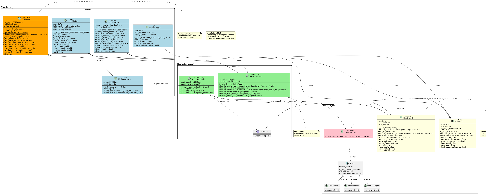
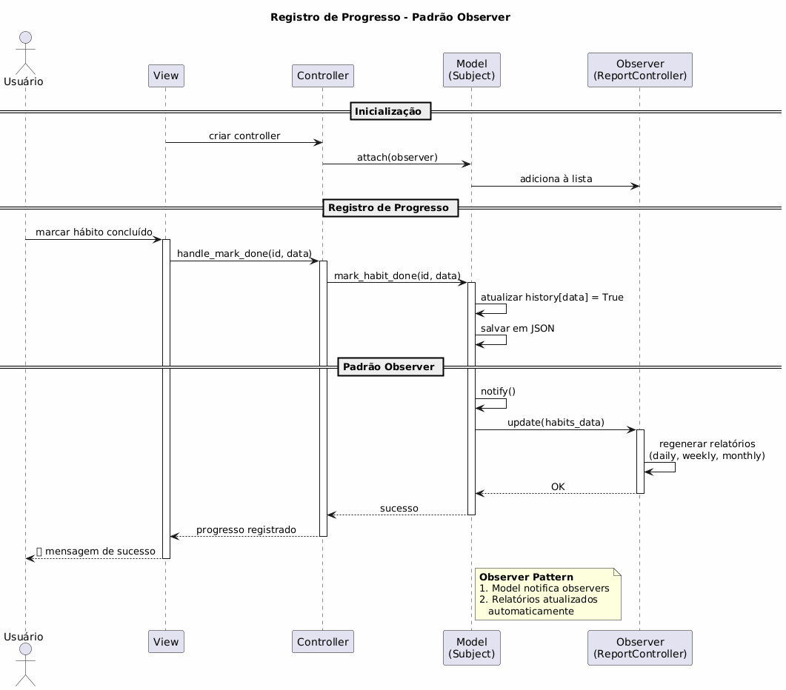
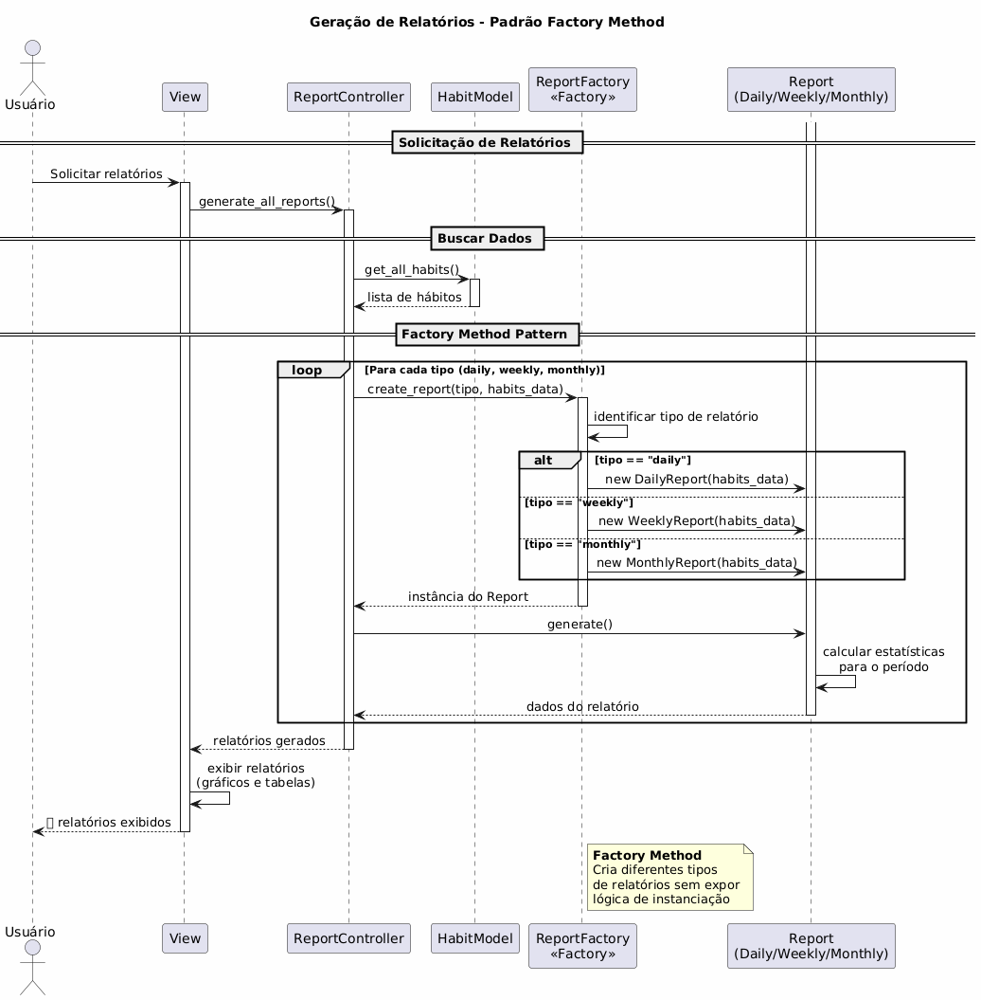
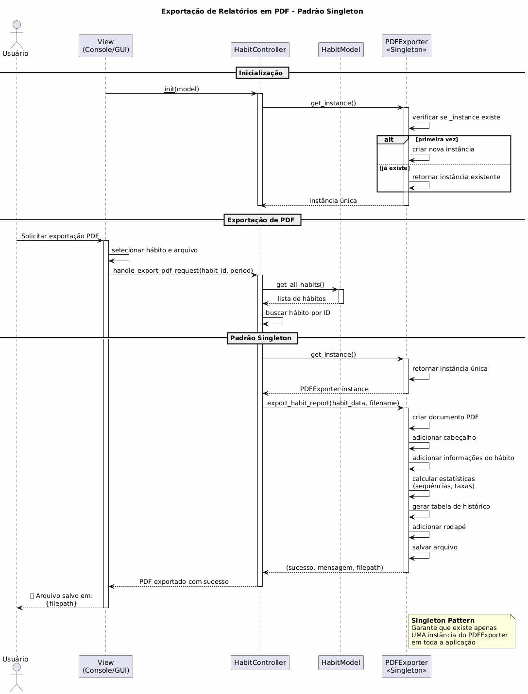

# ES_2025.2

> **Sumário**
> - [1. Ideia do projeto](#1-ideia-do-projeto)
>    - [1.1. Descrição](#11-descrição)
>    - [1.2. Funções principais](#12-funções-principais)
>    - [1.3. Padrões de projeto e estrutura geral](#13-padrões-de-projeto-e-estrutura-geral)
>       - [1.3.1. Padrão de Arquitetura: MVC (Model-View-Controller)](#131-padrão-de-arquitetura-mvc-model-view-controller)
>       - [1.3.2. Padrão de Criação: Factory Method](#132-padrão-de-criação-factory-method)
>       - [1.3.3. Padrão Comportamental: Observer](#133-padrão-comportamental-observer)
>       - [1.3.4. Padrão de Criação: Singleton](#134-padrão-de-criação-singleton)
>       - [1.3.5. Persistência de Dados](#135-persistência-de-dados)
>       - [1.3.6. Estrutura de Pacotes](#136-estrutura-de-pacotes)
>       - [1.3.7. Diagrama de classes](#137-diagrama-de-classes)
>       - [1.3.8. Diagramas de sequência](#138-diagramas-de-sequência)
>          - [1.3.8.1. Registro de progresso (Observer)](#1381-registro-de-progresso-observer)
>          - [1.3.8.2. Geração de relatórios (Factory)](#1382-geração-de-relatórios-factory)
>          - [1.3.8.3. Exportação de PDF (Singleton)](#1383-exportação-de-pdf-singleton)
> - [2. Viabilidade técnica](#2-viabilidade-técnica)
> - [3. Definições relacionadas à gerência de qualidade](#3-definições-relacionadas-à-gerência-de-qualidade)
>   - [3.1. Padrões de segurança](#31-padrões-de-segurança)
>   - [3.2. Padrões de qualidade](#32-padrões-de-qualidade)
>   - [3.3. Papéis e atividades](#33-papéis-e-atividades)
>   - [3.4. Definições de atividades recorrentes para validação dos padrões propostos](#34-definições-de-atividades-recorrentes-para-validação-dos-padrões-propostos)
>       - [3.4.1. Para o caso de código](#para_o_caso_de_codigo)
>       - [3.4.2. Para o caso de documentação](#para_o_caso_de_documentacao)

## 1. Ideia do projeto
O presente projeto possui como principal intuito a criação de um sistema de gerenciamento de hábitos com capacidade de criação de conta e acompanhamento da criação e evolução pessoal dos hábitos escolhidos pelo próprio usuário.

### 1.1. Descrição
Uma aplicação para registro de hábitos diários (ex: estudar, beber água, fazer exercícios), com histórico e relatórios básicos e mecanismos de incentivo ao desenvolvimetno do hábito, por meio de técnicas de gameficação com base em estudos científicos. 
    
### 1.2. Funções principais
A aplicação proposta seria composta por 3 principais funções: 
1. Cadastro de hábitos (CRUD: criar, editar, excluir e modificar).
2. Registro diário de progresso (checkboxes ou botões).
3. Exibição e exportação de relatórios diário, mensal e semanal

### 1.3. Padrões de projeto e estrutura geral
Os padrões de projeto consistem em várias arquiteturas documentadas e especializadas em determinados tipos de funções para uma aplicação. A seguir, são listados os padrões de projeto e arquitetura utilizados durante o desenvolvimento da aplicação proposta, assim como as explicações para a utilização de cada padrão de projeto utilizado para cada função presente na aplicação.

#### 1.3.1. Padrão de Arquitetura: MVC (Model-View-Controller)
O padrão **MVC** foi escolhido como arquitetura base do sistema de gerenciamento de hábitos por proporcionar uma clara separação de responsabilidades entre as camadas da aplicação:

- **Model (Modelo)**: Responsável pela lógica de negócio e manipulação de dados. No projeto, os modelos (`HabitModel`, `UserModel`, `ReportFactory`) gerenciam as operações relacionadas a hábitos, usuários e relatórios, incluindo validações e persistência em arquivos JSON.

- **View (Visão)**: Responsável pela apresentação dos dados ao usuário. O sistema possui duas interfaces: `ConsoleView` para interação via terminal e `GUI` (LoginWindow e MainWindow) para interface gráfica, permitindo flexibilidade na forma de interação.

- **Controller (Controlador)**: Atua como intermediário entre Model e View, processando as entradas do usuário e coordenando as operações. Os controladores (`HabitController`, `ReportController`) recebem comandos da interface, invocam os modelos apropriados e atualizam as visualizações.

O MVC foi escolhido porque facilita a manutenção e evolução do código, permite o desenvolvimento paralelo de diferentes componentes, facilita testes unitários (cada camada pode ser testada independentemente) e possibilita a criação de múltiplas interfaces (console e GUI) compartilhando a mesma lógica de negócio.

--- 

O material utilizado para escolha e estudo do modelo MVC pode ser encontrado em: [https://www.devmedia.com.br/padrao-mvc-java-magazine/21995]

---

#### 1.3.2. Padrão de Criação: Factory Method
O padrão **Factory Method** foi implementado através da classe `ReportFactory` para a criação de diferentes tipos de relatórios:

- Permite criar relatórios diários, semanais e mensais de forma padronizada
- Encapsula a lógica de criação, facilitando a adição de novos tipos de relatórios
- Centraliza a responsabilidade de instanciação em um único local

Este padrão foi escolhido porque o sistema precisa gerar diferentes tipos de relatórios com estruturas e cálculos variados. O Factory Method permite adicionar novos formatos de relatório sem modificar o código cliente, seguindo o princípio Open/Closed (aberto para extensão, fechado para modificação).

---

O material utilizado para escolha e estudo do padrão de projeto Factory está disponível em: [https://www.devmedia.com.br/padrao-mvc-java-magazine/21995]

---

#### 1.3.3. Padrão Comportamental: Observer
O padrão **Observer** é utilizado para notificação de mudanças no estado dos hábitos e atualização automática das interfaces:

- Quando um progresso é registrado em um hábito, os componentes de visualização (relatórios, estatísticas) são automaticamente notificados
- Permite que múltiplos observadores (diferentes views) sejam atualizados simultaneamente
- Implementa um mecanismo de assinatura/publicação para desacoplamento entre componentes

O Observer foi implementado para garantir que todas as visualizações do sistema se mantenham sincronizadas com o estado atual dos dados. Quando o usuário registra progresso em um hábito, os painéis de estatísticas, gráficos e relatórios são atualizados automaticamente sem necessidade de recarregamento manual, melhorando a experiência do usuário e mantendo a consistência dos dados exibidos.

---

O material utilizado para escolha e estudo do padrão de projeto Observer está disponível em: [https://www.devmedia.com.br/padrao-mvc-java-magazine/21995]

---

#### 1.3.4. Padrão de Criação: Singleton
O padrão **Singleton** foi implementado na classe `PDFExporter` para garantir que apenas uma única instância do exportador de PDF exista durante toda a execução da aplicação:

- **Instância única**: O Singleton garante que apenas um objeto `PDFExporter` seja criado, independentemente de quantas vezes a classe seja instanciada
- **Controle de inicialização**: A inicialização dos estilos e configurações do PDF ocorre apenas uma vez, evitando processamento desnecessário
- **Acesso global controlado**: Fornece um ponto de acesso global à instância através do método `get_instance()` ou através do construtor padrão

A implementação do Singleton foi feita em `PDFExporter` e utiliza das seguintes variáveis e métodos:
- Atributo de classe `_instance`: armazena a única instância da classe
- Atributo de classe `_initialized`: controla se a inicialização já foi realizada
- Método `__new__()`: para controlar a criação de instâncias
- Método `get_instance()`: método alternativo para obter a instância única

O fluxo geral da função implementada no código é feita da seguinte forma:
1. O usuário solicita a exportação de um relatório através da interface
2. O sistema obtém a instância única do `PDFExporter`
3. O exportador formata os dados do hábito em um relatório estruturado
4. O PDF é gerado com informações detalhadas:
   - Cabeçalho com nome do hábito
   - Informações gerais , como descrição, frequência, status, data de criação
   - Resumo de progresso, como dias registrados, taxa de conclusão, sequência atual
   - Histórico detalhado dos últimos 30 dias
   - Rodapé com data e hora de geração

Este padrão foi escolhido para a exportação de PDF por conta da economia de memória, evitando a criação de várias instâncias da mesma classe, consistência visual nos PDFs gerados e do gerenciamento centralizado que o padrão de projeto é capaz de oferecer ao limitar a criação de objetos.

---

O material utilizado para escolha e estudo do padrão de projeto Singleton está disponível em: [https://refactoring.guru/design-patterns/singleton]

---

#### 1.3.5. Persistência de Dados
O sistema utiliza **arquivos JSON** para armazenamento de dados:

- `usuarios.json`: Armazena informações de usuários e autenticação
- `habitos_registros.json`: Mantém o histórico de hábitos e registros de progresso

A escolha por JSON foi feita considerando a simplicidade do projeto, facilidade de leitura e edição manual dos dados (útil para debugging), portabilidade entre diferentes sistemas, e não necessidade de um servidor de banco de dados complexo para um sistema de uso individual/local.

#### 1.3.6. Estrutura de Pacotes

O projeto segue uma organização modular em pacotes:

```
HabitTracker/
├── Model/          # Classes de modelo e lógica de negócio
├── view/           # Interfaces de usuário (console e GUI)
├── controller/     # Controladores que coordenam Model e View
└── *.json          # Arquivos de persistência de dados
```

Esta estrutura facilita a localização de componentes, manutenção do código, implementação de testes unitários por camada, e permite que diferentes membros da equipe trabalhem em paralelo em diferentes camadas sem conflitos significativos.

#### 1.3.7. Diagrama de classes


#### 1.3.8. Diagramas de sequência
Abaixo se encontram os diagramas de sequência utilizados para o desenvolvimento do projeto, para eclucidação do que seria feito posteriormente na programação das funções: 

##### 1.3.8.1. Registro de progresso (Observer)


##### 1.3.8.2. Geração de relatórios (Factory)


##### 1.3.8.3. Exportação de PDF (Singleton)


## 2. Viabilidade Técnica
Dados os estudos científicos recolhidos e a crescente demanda para o desenvolvimento de hábitos, é possível considerar como altamente viável o desenvolvimento de uma aplicação com o intuito do desenvolvimento pessoal, com foco na criação e mantenimento de hábitos. Além disso, todos os padrões estão devidamente descritos e é possível obter uma visão clara do funcionamento do sistema a partir da presente documentação.

## 3. Definições relacionadas à gerência de qualidade
Abaixo são definidos os padrões de segurança e qualidade, os quais são fatores determinantes para o desenvolvimetno do projeto como um todo. 

### 3.1. Padrões de segurança
Assim como define Sommerville (2019), os padrões de segurança podem ser divididos em padrões de _Safety_ e de _Security_, sendo o primeiro o conjunto de práticas destinadas à prevenção de danos físicos e econômicos, enquanto o segundo destina-se à prevenção de acesso não autorizado ou ataques maliciosos na aplicação.
Deste modo, são definidos as seguintes premissas para os padrões de segurança:
 - O aplicativo deve solicitar apenas as permissões mínimas necessárias para seu funcionamento, evitando acesso a dados ou recursos do dispositivo que não sejam essenciais.
 - O aplicativo deve ser assinado digitalmente e ter suas atualizações testadas e verificadas antes da publicação, prevenindo a introdução de novas vulnerabilidades.
 - Todas as dependências e bibliotecas externas devem ser mantidas atualizadas e provenientes de fontes seguras, evitando o uso de versões vulneráveis ou não mantidas.
 - Nenhum dado sensível deve ser exposto em logs, nem salvo em texto plano, respeitando as normas de privacidade e proteção de dados, como a LGPD (Lei Geral de Proteção de Dados).
 - O aplicativo deve evitar funcionalidades não autorizadas e garantir que seu comportamento seja transparente e previsível para o usuário.  

**Como os padrões listados serão validados?**  
Os padrões de segurança acima listados serão validados a partir de reuniões semanais para revisão dos últimos _commits_ lançados na branch ```main``` do repositório do Github, a qual é reservada para a disponibilização da última versão estável da aplicação.  

---

Todas as funcionalidades apresentadas estão disponíveis no documento de normas de segurança do NIST (National Institute of Standards and Techonology) do departamento de comércio dos Estados Unidos. O respectivo documento possui como título "Vetting the Secutiry of Mobile Applications", foi redigido por Steve Quirolgico, Jeffrey Voas, Tom Karygiannis, Christoph Micheal e Karen Scarfone e está disponível no seguinte link: [http://dx.doi.org/10.6028/NIST.SP.800-163].

---

### 3.2. Padrões de qualidade
Conforme Sommerville (2019), os padrões de qualidade podem ser divididos em duas categorias: de produto e de processo. Os padrões de produtos definem características de qualidade do produto ou à documentação desenvovlida durante a produção do produto, podendo incluir padrões relacionados à: 

- A estrutura do documento de requisitos
- Padrões de documentação, como comentários padrão na criação de determinadas classes
- Padrões de codificação, como o estilo de variáveis e classes a serem codificadas

Já os padrões de processo definem o conjunto de processos relacionados a especificação, projeto e validação durante o desenvolvimento do software. 
Logo, abaixo se encontram os padrões de qualidade que pautarão o desenvolvimento da aplicação: 

- Utilização da linguagem Python, por conta da rápida implementação e vasta quantidade de bibliotecas.
- Utilização do padrão PEP8, para manutenção de um código legível e baseado em premissas objetivas e simples. A documentação do padrão PEP8 se encontra no seguinte link: [https://peps.python.org/pep-0008/].
- As descrições dos _commits_ devem ser redigidas de modo claro, objetivo e breve, para organização de cada branch e do repositório como um todo. 
- Os _commits_ a serem enviados devem ser o mais modulares possíveis, ou seja, devem englobar apenas ao que se propõe na descrição do mesmo, para o caso da necessidade de voltar a um determinado ponto do desenvolvimento, sem maiores perdas de progresso no desenvolvimento.
- As descrições dos _commits_ devem seguir a convenção descrita abaixo, para facilitação da identificação do tipo de _commit_ e na construção do changelog: 
```
    <tipo>: <mensagem curta>
    Sendo que <tipo> pode ser: 
        - feat: representa a adição de uma função ou arquivo
        - fix: correção de um erro, bug ou lógica no código
        - docs: atualização na documentação
        - style: atualização de formatação em um ou mais arquivos de código
        - refactor: reescrita de código visando melhoria de performance ou lógica
        - test: adição de teste unitário 
        - chore: atualização de dependências do projeto
```

**Como os padrões listados serão validados?**
Os padrões de qualidade acima listados serão validados a partir da observação do histórico de _commits_ durante a produção, assim como nas reuniões semanais.

--- 

As menções às definições de padrão de qualidade e padrões de segurança se encontram na décima edição do livro "Engenharia de Software" escrito por Ian Sommerville, estando disponível em [https://archive.org/details/sommerville-engenharia-de-software-10e]

---

### 3.3. Papéis e atividades 
O método **SCRUM** é um framework ágil de gerenciamento de projetos que visa promover a colaboração contínua, a entrega incremental de valor e a adaptação rápida às mudanças. Ele é estruturado em ciclos curtos chamados **sprints**, nos quais a equipe trabalha em um conjunto definido de tarefas, buscando entregar incrementos funcionais do produto a cada iteração. O SCRUM baseia-se em três pilares principais: **transparência**, **inspeção** e **adaptação**, garantindo que o processo seja constantemente aprimorado por meio de reuniões regulares, como as *daily meetings* e *reviews*.

Dentro do contexto do projeto, os papéis foram distribuídos da seguinte forma:

* **Arthur** atuará como *Scrum Master*, sendo responsável por facilitar as cerimônias do SCRUM, remover impedimentos e garantir que o time siga os princípios e práticas ágeis estabelecidas.
* **Ian** assumirá o papel de *Product Owner*, ficando encarregado de definir as prioridades do produto, gerenciar o backlog e assegurar que as entregas estejam alinhadas às necessidades e objetivos do projeto.
* **Silvino** desempenhará o papel de *Developer*, sendo responsável pela implementação das funcionalidades, manutenção do código e colaboração direta nas revisões e planejamentos semanais.

Essa estrutura garante uma comunicação eficaz entre os membros, favorece a organização do trabalho e assegura entregas consistentes e alinhadas com os objetivos do sistema de gerenciamento de hábitos.

### 3.4. Definições de atividades recorrentes para validação dos padrões propostos
A presente seção possui como intuito a recapitulação e resumo das atitudes a serem tomadas para a contínua validação dos padrões propostos nas seções 3.1 e 3.2, para facilitação e organização de cada reunião semanal do projeto.
Cada reunião semanal será norteada nas seguintes premissas: 
1. Cada membro deverá demonstrar as próprias contribuições feitas desde a última reunião e enviadas ao repositório para todos os outros membros, de forma a explicar no código/documentação e na prática o que foi feito. Devem ser observados os seguintes pontos para cada caso:

<div id="para_o_caso_de_codigo"></div> 

> **3.4.1. Para o caso de código**
> - **As contribuições trazidas necessitam de alguma permissão a ser concedida por parte do usuário?**  
    Tal ponto deve ser observado por questões de segurança e por questões de transparência de permissões para o usuário, para que o usuário tenha ciência do tipo de informação que a aplicação possui acesso. 
> - **O _commit_ obedece a convenção estabelecida e possui descrição curta e objetiva?**  
    Tal ponto deve ser observado para manutenção da legibilidade e organização dos últimos _commits_ submetidos ao repositório.
> - **A contribuição trouxe a utilização de uma nova biblioteca não instalada no projeto anteriormente? A biblioteca é segura e está atualizada?**   
    Tal ponto deve ser observado para que haja transparência entre os membros e a manutenção da segurança da aplicação.
> - **A contribuição utiliza alguma forma de _logging_? Caso positivo, as mensagens de _log_ expõem alguma informação sensível?**  
    Tal ponto deve ser observado para que hajam menores chances de vazamento de dados sensíveis dos usuários da aplicação.
> - **O novo recurso trazido pela contribuição possui alguma situação onde é possível quebrar a aplicação?**  
    Tal ponto deve ser observado para que não haja uma quebra na fluidez da experiência do usuário e possíveis brehcas de segurança.
> - **O novo recurso trazido pela contribuição lida com dados sensíveis?**  
    Tal ponto deve ser observado para que hajam outras verificações como a de permissões e mensagens de _log_, assim como verificações para encapsulamento das informações sensíveis sendo manuseadas.

<div id="para_o_caso_de_documentacao"></div> 

> **3.4.2. Para o caso de documentação**
> - **O commit que trouxe a contribuição para a documentação segue a convenção?**  
    Tal ponto deve ser observado para manutenção da legibilidade e organização dos últimos _commits_ submetidos ao repositório.
> - **A documentação trazida pela contribuição coincide exatamente com as contribuições no código?**  
    Tal ponto deve ser observado para que a documentação possa continuamente refletir no código.